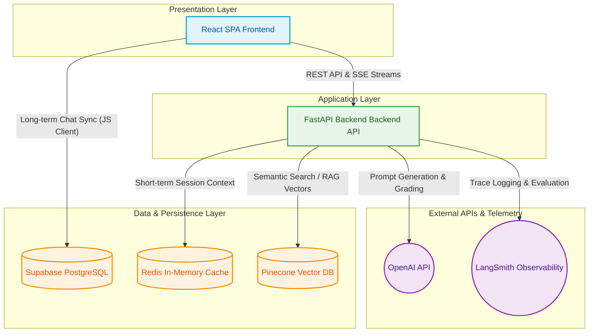

# System Architecture Diagram
**Figure 4.1: UOE AI Assistant Architecture**

You can copy this Mermaid.js code directly into your Final Year Project documentation (Notion, GitHub, Obsydian, or any markdown viewer supporting Mermaid). It will automatically render as a professional technical flowchart.

### Flow Breakdown for Documentation:
1. **React SPA (Frontend)**: Handles the user interface, maintains real-time Server-Sent Events (SSE) connections with the backend, and directly interfaces with Supabase to persist long-term chat histories.
2. **FastAPI (Backend)**: Operates as the stateless orchestration layer executing the Agentic RAG graph logic.
3. **Data Layer**: 
    - **Pinecone**: Performs high-speed vector proximity searches across distinct program namespaces.
    - **Redis**: Maintains short-lived buffers of prior conversational history to give the LLM memory without hitting disk.
    - **Supabase**: Relational persistence engine exclusively enforcing user-tenant isolation via RLS.
4. **External APIs**: 
    - **OpenAI**: The core inference engine powering generative rewrites, context generation, and hallucination scoring.
    - **LangSmith**: Injected throughout the FastAPI graph nodes tracking token latency and debugging traces.
