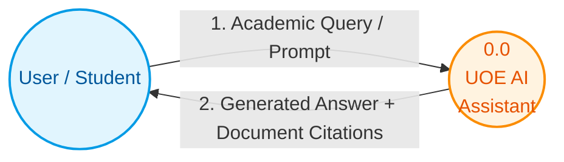

# Data Flow Diagram (DFD) Level 0
**Figure 4.2: DFD Level 0 (Context Diagram)**

You can copy this Mermaid.js code directly into your Final Year Project documentation. This represents the absolute highest-level view (Level 0) displaying the core system boundary acting as a single process bubble interacting with external entities.

### Flow Breakdown for Documentation:
- **External Entity (User / Student):** The source providing input queries regarding University rules, semester courses, or admission criteria.
- **Process 0.0 (UOE AI Assistant):** The entire application boundary abstracted into a single logical node. 
- **Inbound Data Flow:** The user's natural language query text.
- **Outbound Data Flow:** The semantically verified response from the assistant, bundled with original source citation cards.
