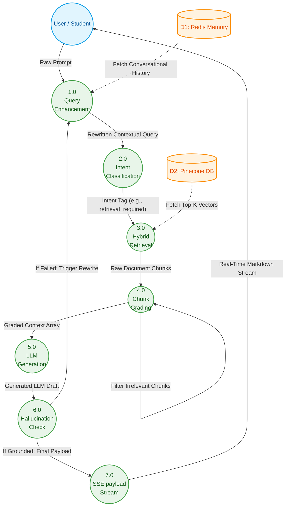

# Data Flow Diagram (DFD) Level 1
**Figure 4.3: DFD Level 1 (Internal System Processes)**

You can copy this Mermaid.js code directly into your Final Year Project documentation. This diagram expands the Level 0 Context diagram to reveal the internal state machine (Agentic RAG) components and data pipelines.

### Flow Breakdown for Documentation:
- **1.0 Query Enhancement**: Receives the raw user input and pulls past session turns from the Redis Datastore to rewrite the question comprehensively.
- **2.0 Intent Classification**: Determines if the query requires external vector knowledge or if it is a general chat greeting.
- **3.0 Hybrid Retrieval**: Executes a dense/sparse query across Pinecone namespaces generating raw context chunks.
- **4.0 Chunk Grading**: Filters the raw vectors, dropping off-topic chunks to maximize context window relevancy.
- **5.0 LLM Generation**: Prompts the LLM strictly bound against the graded document array.
- **6.0 Hallucination Check**: A post-generation verification loop. If the assistant invents answers, the flow is thrown backward into a rewrite/retry cycle. 
- **7.0 SSE Stream**: Server-Sent Events controller beaming the finalized markdown packets incrementally back to the user interface.
