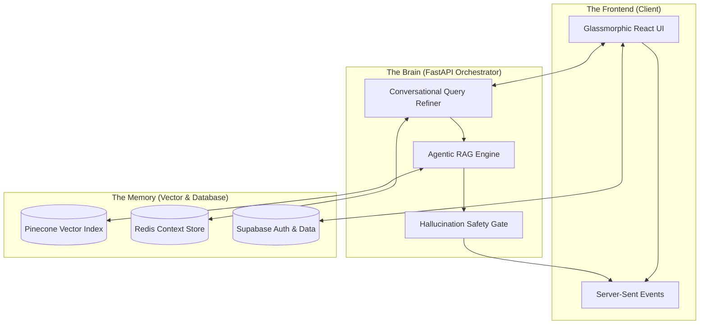

<p align="center">
  <picture>
    <source media="(prefers-color-scheme: dark)" srcset="frontend/public/unnamed.jpg">
    
  </picture>
</p>

<h1 align="center">🎓 UOE AI Assistant</h1>

<p align="center">
  <strong>The Intelligent Knowledge Gateway for the University of Education, Lahore</strong>
</p>

<p align="center">
  <em>A state-of-the-art Agentic RAG system engineered for academic precision, conversational depth, and zero-hallucination reliability.</em>
</p>

<p align="center">
  
  
  
  
  
  
</p>

<div align="center">
  <a href="#-core-architecture">Architecture</a> •
  <a href="#-technical-features">Features</a> •
  <a href="#-knowledge-ecosystem">Knowledge Base</a> •
  <a href="#-installation">Setup</a> •
  <a href="#-development-team">The Team</a>
</div>

---

## ⚡ Overview

The **UOE AI Assistant** represents a leap forward in institutional AI. Moving beyond simple chatbots, it implements an **Agentic Retrieval-Augmented Generation (RAG)** pipeline specifically tuned for university data—from course outlines to hostel regulations. It doesn't just "guess" answers; it searches, verifies, and cites official university documents with sub-second latency.

---

## 🏗️ Core Architecture

The system operates on an **Agentic Graph** that orchestrates intent, retrieval, and validation in a closed-loop system.



---

## 🔥 Technical Features

### 🧠 Agentic Intent Routing
The assistant autonomously classifies student queries into distinct domains (Academic, General, or Policies), ensuring the retrieval engine targets the correct data namespace with 100% precision.

### 🛡️ Hallucination-Free Assurance
Equipped with a **Three-Stage Grounding Guard**:
- **Grounded**: Every claim is tied to a specific chunk ID in the retrieved documents.
- **Self-Correction**: If the initial retrieval is insufficient, the agent re-decomposes the query and tries again.
- **Zero-Trust**: Responses that cannot be verified against the university's source truth are blocked and replaced with a clarifying fallback.

### 🎯 Hybrid Semantic-Filter Search
We combine the "vibe" of semantic search with the "rigor" of SQL-style filtering:
- **Neural Search**: Uses `text-embedding-3-large` for deep conceptual understanding.
- **Metadata Enforcer**: Automatically parses course codes (e.g., `COMP3149`) and program names to apply hard Pinecone filters, eliminating noise from irrelevant departments.

### 🎤 Unified Voice Intelligence
A premium voice pipeline that supports local dialects:
- **Whisper Integration**: High-accuracy STT.
- **Transliterator**: Converts Urdu/Hindi voice inputs into clean Roman Urdu/English for the RAG engine.
- **Normalizer**: Fixes stuttering and semantic drift before the query hits the vector store.

---

## 📁 Knowledge Ecosystem

The system is powered by over **28,800 semantic nodes** indexed into four high-performance namespaces:

| Namespace | Focus Area | Source Depth |
| :--- | :--- | :--- |
| **`bs-adp-schemes`** | Undergraduate Academics | 160+ Full Course Outlines |
| **`ms-phd-schemes`** | Graduate Research | 21+ Advanced Program Files |
| **`rules-regulations`** | University Statutes | Grading, Attendance, UMC Codes |
| **`about-university`** | General Info | Fees, Contacts, Administrative Structure |

---

## 🚀 Installation

### 1. Backend Engine
Ensure you have Python 3.12+ and a Redis instance running.
```bash
git clone https://github.com/HammadAli08/UOE_AI_Assistant.git
cd backend
python -m venv .venv && source .venv/bin/activate
pip install -r requirements.txt
python main.py
```

### 2. Frontend Interface
Built with Vite for near-instant HMR.
```bash
cd frontend
npm install
npm run dev
```

---

## 👨‍💻 Development Team

This project was developed with absolute dedication at the **University of Education, Lahore**.

<table align="center">
  <tr>
    <td align="center">
      <br />
      <strong>Hammad Ali Tahir</strong><br />
      <em>Group Leader & Architect</em>
    </td>
    <td align="center">
      <br />
      <strong>Muhammad Muzaib</strong><br />
      <em>Backend Strategist</em>
    </td>
    <td align="center">
      <br />
      <strong>Ahmad Nawaz</strong><br />
      <em>Frontend Specialist</em>
    </td>
  </tr>
</table>

---

<p align="center">
  
</p>
