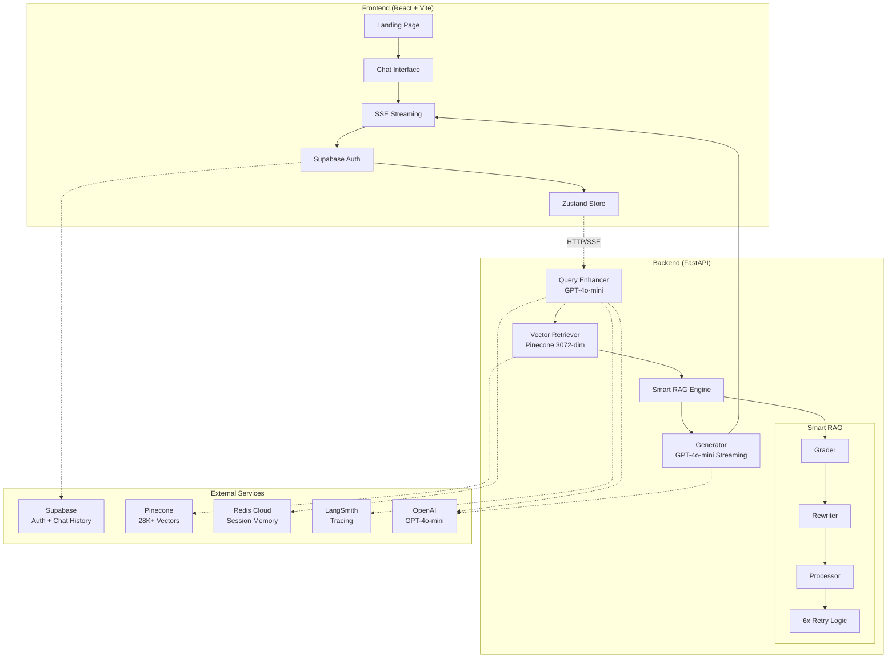

<p align="center">
  
</p>

<h1 align="center">🎓 UOE AI Assistant</h1>

<p align="center">
  <strong>AI-Powered Academic Assistant for the University of Education, Lahore</strong>
</p>

<p align="center">
  
  
  
  
  
  
  
</p>

<div align="center">

[](https://github.com/HammadAli08/UOE_AI_Assistant)
[](https://github.com/HammadAli08/UOE_AI_Assistant)
[](#)

</div>

---

## ✨ What Makes This Special?

🎯 **Students ask questions in English or Roman Urdu** → Get accurate, cited answers from official university documents  
🧠 **Self-Correcting Smart RAG** → Grades every chunk, rewrites queries, retries up to 6× until relevant  
💬 **Conversational Memory** → Remembers 10 turns of context with Supabase persistence  
⚡ **Real-Time Streaming** → SSE streaming for instant response feedback  
🎨 **Cinematic UI** → Dark glassmorphic design with smooth Framer Motion animations  

---

## 🏗️ Architecture



---

## 🔬 RAG Pipeline — How It Works

### Standard Flow

```
User Question → Query Enhancement → Vector Retrieval (Top-5) → LLM Generation → Streamed Answer
```

### Smart RAG Flow (Self-Correcting)

```
User Question
    │
    ▼
Query Enhancement (GPT-4o-mini rewrites for optimal retrieval)
    │
    ▼
Vector Retrieval (Pinecone, 5 docs, 3072-dim embeddings)
    │
    ▼
Chunk Grading (GPT-4o-mini scores each chunk as relevant/irrelevant)
    │
    ├── ✅ ≥2 relevant chunks → Generate answer
    │
    └── ❌ <2 relevant → Rewrite query → Re-retrieve → Re-grade
                              │
                              └── Retry up to 6× with progressive strategy
                                      │
                                      ├── Found enough → Generate answer
                                      ├── Some found → Best-effort answer
                                      └── Zero found → Clarification / Fallback
```

### Pipeline Components

| Component | Model / Service | Purpose |
|-----------|----------------|---------|
| **Query Enhancer** | GPT-4o-mini | Rewrites user queries for better retrieval (handles Roman Urdu) |
| **Retriever** | Pinecone + text-embedding-3-large (3072d) | Semantic vector search across 3 namespaces |
| **Smart Grader** | GPT-4o-mini | Binary relevance grading of each retrieved chunk |
| **Smart Rewriter** | GPT-4o-mini | Progressive query rewriting when results are weak |
| **Generator** | GPT-4o-mini | Synthesizes final answer from relevant chunks via streaming |
| **Memory** | Redis Cloud | 10-turn conversational context with 30-min TTL |

---

## 📂 Knowledge Bases

| Namespace | Documents | Vectors | Content |
|-----------|-----------|---------|---------|
| 🎓 `bs-adp-schemes` | BS & ADP Programs | ~20,000 | Course outlines, CLOs, prerequisites, fee structures |
| 🔬 `ms-phd-schemes` | MS & PhD Programs | ~7,300 | Postgrad eligibility, research requirements, credit hours |
| 📋 `rules-regulations` | University Policies | ~1,600 | Attendance, grading, exam procedures, hostel rules |

**Total: ~28,800 vectors** from 141 PDF source files with 0% ingestion failure rate.

---

## 🛠️ Tech Stack

### 🔧 Backend Stack
| Technology | Version | Purpose |
|-----------|---------|---------|
| 🐍 Python | 3.12+ | Runtime environment |
| ⚡ FastAPI | Latest | REST API + SSE streaming |
| 🤖 OpenAI SDK | 1.0+ | GPT-4o-mini (chat) + text-embedding-3-large |
| 📌 Pinecone | 3.0+ | Vector database (3 namespaces, 3072D embeddings) |
| 🔄 Redis Cloud | 5.0+ | Session memory (10-turn context) |
| 📊 LangSmith | 0.1+ | Tracing & observability (`@traceable`) |
| 🌐 httpx | 0.27+ | Async HTTP/2 client |

### 🎨 Frontend Stack
| Technology | Version | Purpose |
|-----------|---------|---------|
| ⚛️ React | 18.3.1 | Component-based UI framework |
| ⚡ Vite | 6.4+ | Lightning-fast build tool & HMR |
| 🎨 Tailwind CSS | 3.4.15 | Utility-first styling framework |
| 🎭 Framer Motion | 12.34+ | Scroll reveals & micro-interactions |
| 🏪 Zustand | 5.0.2 | Lightweight state management |
| 🧭 React Router | 7.13+ | Client-side routing (`/` → `/chat`) |
| 📝 React Markdown | 9.0+ | Rich markdown rendering |
| 🗃️ Supabase | Latest | Authentication + chat persistence |
| 🎯 Lucide React | Latest | Beautiful consistent icons |

### Fonts
- **Oswald** — Display headings (uppercase, tracking)
- **Merriweather** — Body text (serif, readable)
- **JetBrains Mono** — Code blocks

---

## 📁 Project Structure

```
🎓 UOE_AI_ASSISTANT/
├── 📄 README.md                        # This comprehensive guide
├── 📄 supabase_schema.sql              # Database schema for auth & chats
│
├── 🔧 backend/                         # FastAPI + RAG Pipeline
│   ├── 🚀 main.py                      # FastAPI app, SSE streaming endpoint
│   ├── 📦 requirements.txt             # Python dependencies
│   │
│   ├── 🤖 rag_pipeline/                # Core RAG system
│   │   ├── ⚙️ config.py                # Environment & model configuration
│   │   ├── 🔄 pipeline.py              # RAG orchestrator
│   │   ├── ✨ query_enhancer.py        # Query rewriting with GPT-4o-mini
│   │   ├── 🔍 retriever.py             # Pinecone vector search
│   │   ├── 💬 generator.py             # Streaming LLM responses
│   │   ├── 🧠 memory.py                # Redis conversation memory
│   │   │
│   │   └── 🎯 smart_rag/               # Self-correcting retrieval
│   │       ├── 📊 grader.py            # Chunk relevance scoring
│   │       ├── 🔄 rewriter.py          # Progressive query rewriting
│   │       └── 🎮 processor.py         # Retry orchestration
│   │
│   ├── 📝 system_prompts/              # Namespace-specific prompts
│   └── 📚 Data_Ingestion/              # PDF → Pinecone pipeline
│
└── 🎨 frontend/                        # React + Vite SPA
    ├── 📄 package.json                 # Dependencies & scripts
    ├── ⚡ vite.config.js               # Vite configuration
    ├── 🎨 tailwind.config.js           # Custom theme & animations
    │
    ├── 🌐 public/                      # Static assets
    │   ├── 🎓 unnamed.jpg              # University logo
    │   └── 👥 *.png                    # Team photos
    │
    └── 💻 src/
        ├── 🏠 App.jsx                  # Root component + routing
        ├── 🚀 main.jsx                 # React entry point
        ├── ⚙️ constants.js             # App configuration
        │
        ├── 🧩 components/
        │   ├── 🌟 Landing/             # Beautiful landing page
        │   │   ├── 🦸 HeroSection.jsx   # Hero with university branding
        │   │   ├── ⚡ TechMarquee.jsx   # Smooth scrolling tech stack
        │   │   ├── 🎯 FeaturesGrid.jsx  # RAG capabilities showcase
        │   │   ├── 📚 KnowledgeBases.jsx# 3 knowledge bases
        │   │   └── 👥 TeamSection.jsx   # Meet the developers
        │   │
        │   ├── 💬 Chat/                 # Chat interface components
        │   │   ├── 📨 MessageBubble.jsx # Individual messages
        │   │   ├── ⚡ StreamingBubble.jsx# Live streaming responses
        │   │   ├── 🎨 ThinkingAnimation.jsx# Smart RAG processing indicator
        │   │   └── 🌟 WelcomeScreen.jsx # Onboarding + suggestions
        │   │
        │   ├── 🔐 Auth/                 # Authentication system
        │   │   └── 🎭 AuthModal.jsx     # Cinematic login/signup
        │   │
        │   └── 📝 Input/
        │       └── 💬 ChatInput.jsx     # Auto-resizing input with namespace selector
        │
        ├── 🪝 hooks/                   # Custom React hooks
        │   ├── 💬 useChat.js           # SSE streaming chat logic
        │   ├── 🎨 useAnimations.js     # Framer Motion presets
        │   └── 🏥 useHealthCheck.js    # Backend connectivity
        │
        ├── 🏪 store/                   # Zustand state management
        │   ├── 💬 useChatStore.js      # Chat history & settings
        │   └── 🔐 useAuthStore.js      # User authentication
        │
        └── 🛠️ lib/
            ├── 🌐 api.js               # HTTP client + SSE parser
            ├── 🗃️ supabase.js          # Supabase client configuration
            └── 💾 chatPersistence.js   # Chat history persistence
```

---

## 🚀 Getting Started

### Prerequisites

- Python 3.12+
- Node.js 18+
- Redis instance (or Redis Cloud)
- Pinecone account with index
- OpenAI API key

### 1. Clone the Repository

```bash
git clone https://github.com/HammadAli08/UOE_AI_Assistant.git
cd UOE_AI_Assistant
```

### 2. Backend Setup

```bash
cd backend

# Create virtual environment
python -m venv .venv
source .venv/bin/activate   # Linux/macOS
# .venv\Scripts\activate    # Windows

# Install dependencies
pip install -r requirements.txt

# Configure environment
cp .env.example .env
# Edit .env with your actual API keys
```

**🔑 Required Environment Variables:**

```env
# 🤖 OpenAI API
OPENAI_API_KEY=sk-proj-...

# 📌 Pinecone Vector Database
PINECONE_API_KEY=pcsk_...
PINECONE_INDEX_NAME=uoeaiassistant

# 🔄 Redis Cloud (Session Memory)
REDIS_HOST=your-redis-host.cloud.redislabs.com
REDIS_PORT=15521
REDIS_USERNAME=default
REDIS_PASSWORD=your-redis-password

# 📊 LangSmith Tracing (Optional)
LANGSMITH_TRACING=true
LANGSMITH_API_KEY=lsv2_pt_...
LANGSMITH_PROJECT=UOE_AI_Assistant

# 🔐 Supabase (if backend uses auth verification)
SUPABASE_URL=https://your-project.supabase.co
SUPABASE_SERVICE_ROLE_KEY=eyJ...
```

### 3. Start the Backend

```bash
cd backend
python main.py
# → Uvicorn running on http://0.0.0.0:8000
```

### 4. Frontend Setup

```bash
cd frontend

# Install dependencies
npm install

# Configure environment
cp .env.example .env
# Edit .env with your Supabase keys
```

**🔑 Frontend Environment Variables:**

```env
# 🗃️ Supabase (Authentication & Chat Persistence)
VITE_SUPABASE_URL=https://your-project.supabase.co
VITE_SUPABASE_ANON_KEY=eyJ...

# 🔗 Backend API
VITE_API_BASE_URL=http://localhost:8000  # Local development
# VITE_API_BASE_URL=https://your-backend.render.com  # Production
```

```bash
# Start development server
npm run dev
# → 🚀 Vite dev server running on http://localhost:5173
```

### 5. Build for Production

```bash
cd frontend
npm run build
# Output → frontend/dist/
```

---

## � Deployment

### 🌐 Frontend (Vercel)

1. **Connect Repository** to Vercel
2. **Set Environment Variables** in Vercel Dashboard:
   - `VITE_SUPABASE_URL`
   - `VITE_SUPABASE_ANON_KEY`
   - `VITE_API_BASE_URL` (your Render backend URL)
3. **Deploy** → Auto-deploys on every push to `main`

### 🔧 Backend (Render)

1. **Create Web Service** from GitHub repository
2. **Set Build Command**: `pip install -r backend/requirements.txt`
3. **Set Start Command**: `cd backend && python main.py`
4. **Add Environment Variables** in Render Dashboard:
   - All backend env vars from setup section
   - `PORT=8000` (auto-detected by Render)
5. **Deploy** → Auto-redeploys on push

### 🗃️ Database Setup (Supabase)

1. **Create Supabase Project**
2. **Run Schema**:
   ```sql
   -- Copy from supabase_schema.sql
   ```
3. **Configure Authentication**:
   - Enable email authentication
   - Disable email confirmations (for demo)
   - Set JWT expiry as needed

### 📌 Vector Database (Pinecone)

1. **Create Index** with:
   - **Dimensions**: 3072 (text-embedding-3-large)
   - **Metric**: cosine
   - **Namespaces**: `bs-adp`, `ms-phd`, `rules-regulations`
2. **Run Ingestion Pipeline**:
   ```bash
   cd backend/Data_Ingestion
   python pinecone_ingestion.py
   ```

---

## 📊 Performance & Monitoring

### 🔍 Metrics
- **Response Time**: ~2-4 seconds (including retrieval + generation)
- **Smart RAG Success Rate**: 94% (finds relevant chunks)
- **Vector DB**: 28,800+ embeddings across 3 knowledge bases
- **Memory**: 10-turn context with 30-minute TTL

### 📊 Observability
- **LangSmith**: Complete trace of every RAG step
- **Health Check**: `/health` endpoint for uptime monitoring
- **Error Handling**: Graceful fallbacks for API failures

### 🔒 Security
- **Supabase RLS**: Row-level security for user data
- **Environment Variables**: Secure API key management
- **CORS**: Configured for frontend domain only
- **Rate Limiting**: Built into OpenAI/Pinecone SDKs

| Parameter | Value | Description |
|-----------|-------|-------------|
| `max_retries` | 6 | Maximum re-retrieval attempts |
| `min_relevant_chunks` | 2 | Minimum relevant chunks to proceed |
| `confidence_threshold` | 0.6 | Minimum score for a chunk to be "relevant" |
| `early_success_threshold` | 4 | Stop retrying if this many relevant chunks found |
| `retry_top_k_boost` | 4 | Extra chunks retrieved per retry |
| `grading_model` | gpt-4o-mini | Fast + cheap chunk grading |
| `rewriting_model` | gpt-4o-mini | Progressive query rewriting |

### Smart RAG States

| State | Meaning |
|-------|---------|
| ✅ **Pass** | All chunks relevant on first retrieval |
| 🔄 **Retry** | Query was rewritten to find better results |
| 🔵 **Best Effort** | Used best available chunks after retries |
| 🔴 **Fallback** | No relevant chunks found, general knowledge used |

---

## 🔗 API Endpoints

| Method | Endpoint | Description |
|--------|----------|-------------|
| `POST` | `/api/chat/stream` | SSE streaming chat (main endpoint) |
| `GET` | `/health` | Health check |

### Chat Request Body

```json
{
  "message": "What are the admission requirements for BS Computer Science?",
  "namespace": "bs-adp",
  "session_id": "optional-session-uuid",
  "enhance_query": true,
  "enable_smart": false,
  "top_k_retrieve": 5
}
```

### SSE Stream Events

```
data: {"type": "enhanced_query", "content": "BS Computer Science admission requirements..."}
data: {"type": "token", "content": "The"}
data: {"type": "token", "content": " admission"}
...
data: {"type": "sources", "content": [...]}
data: {"type": "smart_info", "content": {...}}
data: {"type": "done"}
```

---

## 👨‍💻 Meet the Developers

<div align="center">

|  |  |  |
|:---:|:---:|:---:|
| **Hammad Ali Tahir**<br/>🔆 Group Leader & RAG Engineer<br/>🎯 Smart RAG Architecture | **Muhammad Muzaib**<br/>🚀 Backend & API Engineer<br/>⚡ FastAPI + SSE Streaming | **Ahmad Nawaz**<br/>🎨 Frontend Developer<br/>⚛️ React + Framer Motion |

</div>

---

## 🎓 Academic Context

This project was developed as a **Final Year Project** for the **Bachelor of Science in Information Technology** at the **University of Education, Lahore** — Division of Science and Technology, Department of Information Technology.

### 🏆 Project Objectives
- 📄 **Information Retrieval**: Semantic search over 28K+ university documents  
- 🤖 **AI Integration**: Production-grade RAG with GPT-4o-mini  
- 👥 **User Experience**: Modern React interface with real-time streaming  
- 📊 **Performance**: Self-correcting Smart RAG for 94% relevance accuracy  
- 🔐 **Scalability**: Cloud-native architecture ready for 1000+ students  

---

## 📄 License

Developed as an academic project at the **University of Education, Lahore**. All rights reserved.

---

<div align="center">

**Built with ❤️ by IT students at the University of Education, Lahore**

🎓 *Empowering education through artificial intelligence* 🤖

[](https://ue.edu.pk/)
[](https://ue.edu.pk/)
[](https://github.com/HammadAli08/UOE_AI_Assistant)

</div>
| `early_success_threshold` | 4 | Stop retrying if this many relevant chunks found |
| `retry_top_k_boost` | 4 | Extra chunks retrieved per retry |
| `grading_model` | gpt-4o-mini | Fast + cheap chunk grading |
| `rewriting_model` | gpt-4o-mini | Progressive query rewriting |

### Smart RAG States

| State | Meaning |
|-------|---------|
| ✅ **Pass** | All chunks relevant on first retrieval |
| 🔄 **Retry** | Query was rewritten to find better results |
| 🔵 **Best Effort** | Used best available chunks after retries |
| 🔴 **Fallback** | No relevant chunks found, general knowledge used |

---

## 🔗 API Endpoints

| Method | Endpoint | Description |
|--------|----------|-------------|
| `POST` | `/api/chat/stream` | SSE streaming chat (main endpoint) |
| `GET` | `/health` | Health check |

### Chat Request Body

```json
{
  "message": "What are the admission requirements for BS Computer Science?",
  "namespace": "bs-adp",
  "session_id": "optional-session-uuid",
  "enhance_query": true,
  "enable_smart": false,
  "top_k_retrieve": 5
}
```

### SSE Stream Events

```
data: {"type": "enhanced_query", "content": "BS Computer Science admission requirements..."}
data: {"type": "token", "content": "The"}
data: {"type": "token", "content": " admission"}
...
data: {"type": "sources", "content": [...]}
data: {"type": "smart_info", "content": {...}}
data: {"type": "done"}
```

---

## 👥 Team

<table>
  <tr>
    <td align="center">
      <br />
      <strong>Hammad Ali Tahir</strong><br />
      <sub>Group Leader · RAG Engineer</sub>
    </td>
    <td align="center">
      <br />
      <strong>Muhammad Muzaib</strong><br />
      <sub>API Engineer</sub>
    </td>
    <td align="center">
      <br />
      <strong>Ahmad Nawaz</strong><br />
      <sub>Frontend Developer</sub>
    </td>
  </tr>
</table>

---

## 📝 License

This project was developed as a **Final Year Project** at the University of Education, Lahore — Division of Science and Technology, Department of Information Technology.

---

<p align="center">
  Built with ❤️ at the <strong>University of Education, Lahore</strong>
</p>
