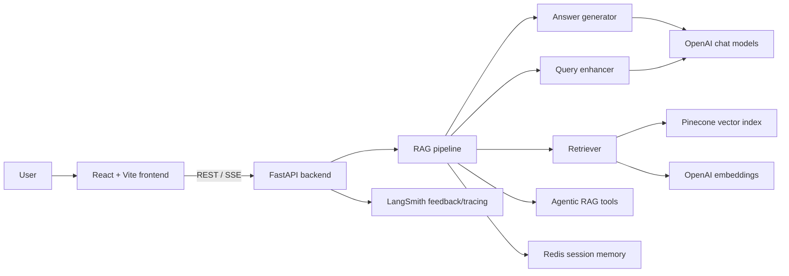

<p align="center">
  <picture>
    <source media="(prefers-color-scheme: dark)" srcset="frontend/public/unnamed.jpg">
    
  </picture>
</p>

<h1 align="center">🎓 UOE AI Assistant</h1>

An AI assistant for the University of Education, Lahore, built with a FastAPI backend, a React/Vite frontend, and a retrieval-augmented generation pipeline over university knowledge sources.

The assistant answers student and staff questions about programs, course schemes, rules, regulations, fees, contacts, and general university information. It uses OpenAI models for generation and embeddings, Pinecone for vector search, Redis for short-term conversation memory, and optional LangSmith tracing for evaluation and feedback.


## What It Does

- Answers questions from four university knowledge areas: BS/ADP schemes, MS/PhD schemes, rules and regulations, and general university information.
- Streams chat responses to the frontend with Server-Sent Events.
- Enhances user queries before retrieval so short, informal, or Roman Urdu questions can still map to the right content.
- Supports an optional agentic RAG mode with intent routing, query decomposition, retrieval retries, and grounding checks.
- Supports voice input through transcription, transliteration, and query normalization.
- Stores short-term session memory in Redis.
- Captures user feedback and can link it to LangSmith traces when tracing is enabled.

## Architecture


```mermaid
flowchart LR
    User["User"] --> Frontend["React + Vite frontend"]
    Frontend -->|"REST / SSE"| API["FastAPI backend"]
    API --> Pipeline["RAG pipeline"]
    Pipeline --> Enhancer["Query enhancer"]
    Pipeline --> Retriever["Retriever"]
    Pipeline --> Generator["Answer generator"]
    Pipeline --> Agentic["Agentic RAG tools"]
    Retriever --> Pinecone["Pinecone vector index"]
    Pipeline --> Redis["Redis session memory"]
    API --> LangSmith["LangSmith feedback/tracing"]
    Generator --> OpenAI["OpenAI chat models"]
    Enhancer --> OpenAI
    Retriever --> OpenAIEmbeddings["OpenAI embeddings"]
```

## Knowledge Namespaces

| UI namespace | Pinecone namespace | Purpose |
| --- | --- | --- |
| `bs-adp` | `bs-adp-schemes` | BS and ADP programs, course outlines, prerequisites, and semesters |
| `ms-phd` | `ms-phd-schemes` | MS, MPhil, and PhD program information |
| `rules` | `rules-regulations` | Policies, grading, attendance, hostel rules, UMC, and other regulations |
| `about` | `about-university` | University overview, campuses, contacts, fees, services, and general information |

## Repository Layout

```text
.
|-- backend/
|   |-- main.py                         # FastAPI app and API endpoints
|   |-- rag_pipeline/                   # Retrieval, generation, memory, and query enhancement
|   |-- rag_pipeline/agentic_rag/       # Intent routing, rewriting, grading, and grounding tools
|   |-- Data_Ingestion/                 # Pinecone ingestion scripts
|   |-- system_prompts/                 # Prompt files used by the RAG pipeline
|   |-- evaluation/                     # Evaluation dataset and RAGAS scripts
|   |-- pyproject.toml                  # Backend dependencies
|   `-- uv.lock                         # Locked Python dependency graph
|-- frontend/
|   |-- src/                            # React app
|   |-- public/                         # Static images and icons
|   |-- package.json                    # Frontend scripts and dependencies
|   `-- vite.config.js                  # Vite configuration
|-- render.yaml                         # Render deployment configuration
|-- supabase_schema.sql                 # Supabase schema reference
`-- README.md
```

## Requirements

- Python 3.12 or newer
- Node.js 22.x
- Redis, local or hosted
- Pinecone index compatible with `text-embedding-3-large` vectors
- OpenAI API key
- Optional: LangSmith API key for tracing and feedback

## Backend Setup

From the repository root:

```bash
cd backend
uv sync
```

Create `backend/.env`:

```env
OPENAI_API_KEY=your_openai_key
PINECONE_API_KEY=your_pinecone_key
PINECONE_INDEX_NAME=uoeaiassistant

REDIS_HOST=localhost
REDIS_PORT=6379
REDIS_USERNAME=default
REDIS_PASSWORD=

OPENAI_EMBEDDING_MODEL=text-embedding-3-large
OPENAI_EMBEDDING_DIMENSIONS=3072
OPENAI_CHAT_MODEL=gpt-4o-mini

LANGSMITH_TRACING=false
LANGSMITH_API_KEY=
LANGSMITH_PROJECT=uoe-ai-assistant
```

Run the API:

```bash
uv run python main.py
```

The backend starts on `http://localhost:8000` by default. Set `PORT` to run it on another port.

## Frontend Setup

From the repository root:

```bash
cd frontend
npm install
npm run dev
```

The frontend runs on the Vite dev server, usually `http://localhost:5173`.

For local development, the app can call `/api` through the Vite proxy. For production, set:

```env
VITE_API_URL=https://your-backend-domain.com/api
```

## API Endpoints

| Method | Endpoint | Description |
| --- | --- | --- |
| `GET` | `/` | Basic API status |
| `GET` | `/health` | Health check |
| `GET` | `/api/namespaces` | List supported knowledge namespaces |
| `POST` | `/api/chat` | Non-streaming chat response |
| `POST` | `/api/chat/stream` | Streaming chat response with Server-Sent Events |
| `POST` | `/api/transcribe` | Voice transcription and normalization |
| `POST` | `/api/feedback` | Store thumbs up/down feedback, with optional LangSmith linkage |

Example chat request:

```bash
curl -X POST http://localhost:8000/api/chat \
  -H "Content-Type: application/json" \
  -d '{
    "query": "What is the grading policy?",
    "namespace": "rules",
    "enhance_query": true,
    "enable_agentic": false,
    "top_k_retrieve": 5
  }'
```

## RAG Pipeline

The backend pipeline has four main stages:

1. Query enhancement: rewrites informal or underspecified questions into retrieval-friendly queries.
2. Retrieval: searches Pinecone with dense semantic retrieval and namespace-aware filtering.
3. Generation: produces grounded answers using retrieved university context.
4. Memory and feedback: keeps short-term session context in Redis and records user feedback.

When `enable_agentic` is true, the pipeline can also classify intent, split complex questions into sub-questions, retry weak retrieval results, and run hallucination checks before returning an answer.

## Data Ingestion

Ingestion scripts live in `backend/Data_Ingestion/`. They prepare university source documents, generate embeddings with OpenAI, and upsert vectors into Pinecone namespaces.

Common scripts include:

- `canonical_bs_adp_ingestion.py`
- `canonical_ms_phd_ingestion.py`
- `rules_regulations_ingestion.py`
- `university_about_ingestion.py`

Run ingestion only after confirming that `OPENAI_API_KEY`, `PINECONE_API_KEY`, and `PINECONE_INDEX_NAME` are configured correctly.

## Evaluation

Evaluation utilities live in `backend/evaluation/` and include dataset generation plus RAGAS-based evaluation scripts. Use these when changing retrieval, prompts, chunking, or agentic behavior so answer quality can be checked against a consistent benchmark.

## Deployment Notes

- The backend can be deployed to Render using the included `render.yaml`.
- The frontend is Vite-based and can be deployed to Vercel or any static hosting provider.
- Configure production CORS, API URLs, Redis credentials, Pinecone credentials, and OpenAI credentials through the hosting provider's environment settings.
- Do not commit real `.env` files or API keys.

## Team

Developed at the University of Education, Lahore.

- Hammad Ali Tahir - Group Leader and Architect
- Muhammad Muzaib - Backend Strategist
- Ahmad Nawaz - Frontend Specialist
